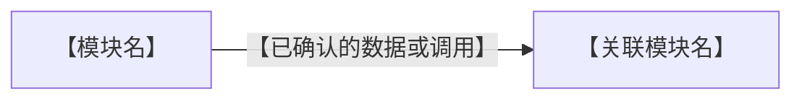

# 架构图

依据:需求原话件第 N 行

只填已确认的模块与联系,把 N 换成真实行号;未确定的架构或接口先交用户确认。

```mermaid
flowchart LR
  A["【模块名】"] -->|"【已确认的数据或调用】"| B["【关联模块名】"]
```

## 接口草图

| 名 | 入参 | 出参 | 错误码 |
|---|---|---|---|
| 【接口名】 | 【已确认入参】 | 【已确认出参】 | 【已确认错误码,未定则标待拍板】 |

接口依据:需求原话件第 N 行
